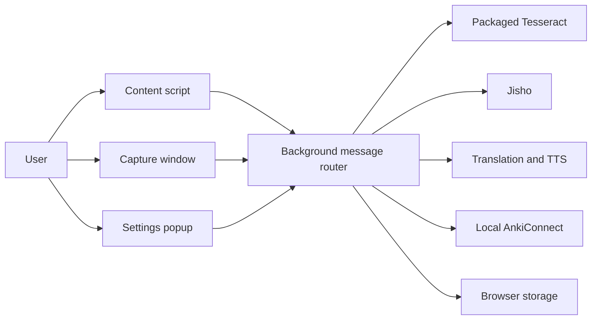

# Architecture

## Current system

The extension has three user-facing entry points:

- `content.js` handles page selection, subtitle discovery, screen-region selection, review UI, and notifications.
- `ocr-capture.js` handles the standalone capture flow used by PDFs and pages where content scripts cannot run.
- `popup.js` handles connection status and Anki settings.

They communicate with `background.js`, which currently owns browser capture, OCR processing, provider calls, field adaptation, duplicate checks, Anki note creation, and synchronization.



## Target boundaries

Refactoring should be incremental: extract tested modules from the background entry point without changing the user workflow or stored settings.

```text
src/
├── entrypoints/       browser-owned startup and UI code
├── application/       mine-note, recognize-region, and settings workflows
├── domain/            note drafts, mappings, duplicate policy, validation
├── adapters/          AnkiConnect, OCR, dictionary, translation, storage
└── shared/            message contracts, errors, and constants
```

Dependencies point inward: entry points call application workflows, workflows use domain rules and injected adapters, and adapters contain provider-specific code. Domain modules must not depend on browser globals or the DOM.

## Runtime flow

1. An entry point creates a validated mining request.
2. The background router delegates it to the appropriate application workflow.
3. The workflow enriches a note draft through dictionary and translation adapters.
4. Domain rules map fields and evaluate duplicate policy.
5. The AnkiConnect adapter writes the note and optionally synchronizes.
6. A structured result returns to the originating UI.

## Refactoring constraints

- Keep the published extension usable after every extraction.
- Centralize message names and payload validation before adding new messages.
- Centralize default settings and field definitions before changing configuration UI.
- Preserve the existing storage keys and migrate versioned schemas explicitly.
- Keep provider failures distinguishable from validation and Anki connection failures.
- Maintain separate unit tests for pure rules and contract tests for adapters.

